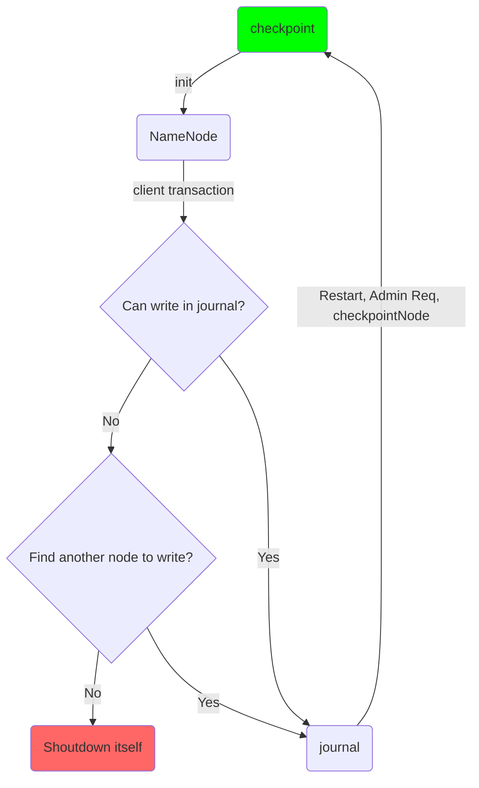
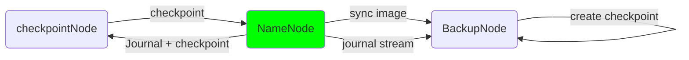
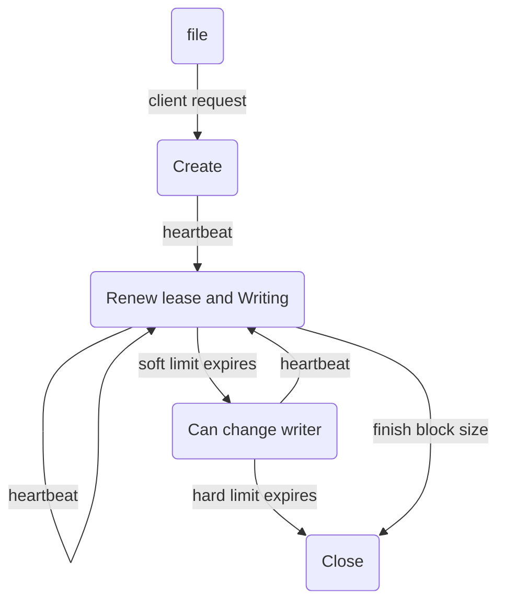
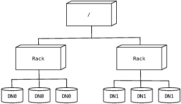

===================================

Overview
---------
Software for reliable, scalable, distributed computing.The [Apache Hadoop software](http://hadoop.apache.org/) library is a framework that allows for the distributed processing of large data sets across clusters of computers using simple programming models.
Hadoop is a framework (consisting of software libraries) which simplifies the processing of data sets distributed across clusters of servers. Two of the main components of Hadoop are **HDFS** and **MapReduce**.
* **HDFS is the filesystem** that is used by Hadoop to store all the data on. This file system spans across all the nodes that are being used by Hadoop. These nodes could be on a single VPS or they can be spread across a large number of virtual servers.
* **MapReduce is the framework that orchestrates all of Hadoop's activities**. It handles the assignment of work to different nodes in the cluster.

Hadoop uses SSH (to access its nodes) which would normally require the user to enter a password.

[Usecases](https://www.pythian.com/blog/what-data-should-we-store-on-hadoop/)
----------
* if you have less than one terabyte of data, Hadoop is likely to be more of a problem than a solution.

* If you have and plan on actually **processing images, videos, sound files, and anything else that is non-text unstructured data**, Hadoop **is definitely the solution**. Storing 1T of image files in a database or storage device and copying them over the network for process on application servers is far less efficient than using Hadoop to process the data where it is stored.

* If you store images and videos without processing them, Hadoop is still a fairly cost effective solution, but at this point you need to calculate cost per terabyte and see which data store makes the most sense.

* If you store text files that are **truly unstructured**, such as blog posts, and plan on **processing them** using natural language processing tools, Hadoop **is a good solution**. It allows you to store unstructured text and process it at the point of storage.

* If you just want to search your text files and don’t plan on processing them, a text-index solution such as SOLR makes more sense.

As you can see Hadoop is a good solution for anywhere that you want to have process on unstructured data.

Installation
------------
32bit Hadoop binary only exist so if you want to install that on 64bit system you must compile it first. to do so go below steps
1. install dependencies to compile code
	```bash
    # apt-get install gcc g++ make maven cmake zlib1g zlib1g-dev libcurl4-openssl-dev
    ```
2. In-order to compile [hadoop V2.7.3](http://www.apache.org/dyn/closer.cgi/hadoop/common/hadoop-2.7.3/hadoop-2.7.3-src.tar.gz) need to install protocol [buffer 2.5.0](https://github.com/google/protobuf/releases/download/v2.5.0/protobuf-2.5.0.tar.gz) on your system
 so goes on these steps
 * Download protobuf 2.5.0 `wget https://github.com/google/protobuf/releases/download/v2.5.0/protobuf-2.5.0.tar.gz`
 * Decompress `tar -xvf protobuf-2.5.0.tar`
 * Compile it 
  	```bash
 	cd protobuf-2.5.0
	./configure --prefix=/usr
	make
	make install
    ```
  * Install java version
    ```bash
    cd java 
	mvn install
	mvn package
    ```

3. Now everything is ready for start compile code. Move to hadoop source root code directory and run `mvn package -Pdist -Pdoc -Psrc -Dtar -DskipTests` to download and install code dependencies

4. Now we can config services to start
    * Set which port to listen on
	```xml
    etc/hadoop/core-site.xml
    <configuration>
        <property>
            <name>fs.defaultFS</name>
            <value>hdfs://localhost:9000</value>
        </property>
    </configuration>
	```
    * Set default replica number
    ```xml
    etc/hadoop/hdfs-site.xml
    <configuration>
        <property>
            <name>dfs.replication</name>
            <value>1</value>
        </property>
    </configuration>
    ```
    * Make sure that you set passphraseless ssh if not run these commands
    ```bash
    $ ssh-keygen -t dsa -P '' -f ~/.ssh/id_dsa
  	$ cat ~/.ssh/id_dsa.pub >> ~/.ssh/authorized_keys
  	$ chmod 0600 ~/.ssh/authorized_keys
    ```
    * The following instructions are to run a MapReduce job locally. Before start service you need to run format command to init some config for DataNode `bin/hdfs namenode -format`
    * At the end start NameNode daemon and DataNode daemon `sbin/start-dfs.sh`
    * he hadoop daemon log output is written to the $HADOOP_LOG_DIR directory (defaults to $HADOOP_HOME/logs). Browse the web interface for the NameNode; by default it is available at: **NameNode - http://localhost:50070/**
    * But if you want to run MapReduce jobs on YARN framework you need to run that before start Hadoop. so in-order that first of all set your MapReduce system as YARN
    ```xml
    etc/hadoop/mapred-site.xml

    <configuration>
    	<property>
        	<name>mapreduce.framework.name</name>
        	<value>yarn</value>
    	</property>
	</configuration>
    ```
    * And then set YARN MapReduce type as shuffel
    ```xml
    etc/hadoop/yarn-site.xml
    <configuration>
        <property>
            <name>yarn.nodemanager.aux-services</name>
            <value>mapreduce_shuffle</value>
        </property>
	</configuration>
    ```
    * Now we can run it with `sbin/start-yarn.sh` bash file and it's monitoring system visible on port **8088**
    * At the end run dfs services by `bin/start-dfs.sh`


Hadoop runs the job by dividing it into tasks, of which there are two types: **map** tasks and **reduce** tasks.
The ++tasks are scheduled using YARN++ and run on nodes in the cluster. If a task fails, it will be automatically rescheduled to run on a different node.
Hadoop divides the input to a MapReduce job into **fixed-size pieces** called input **splits**, or just splits. Hadoop creates one map task for each split, which runs the user-defined
map function for each record in the split.

**Having many splits means** the **time taken to process each split is small** compared to the time to process the whole input. So if we are processing the splits in parallel, **the processing is better load-balanced** when the splits are small, since a faster machine will be able to process proportionally more splits over the course of the job than a slower machine.
Even if the machines are identical, failed processes or other jobs running concurrently make load balancing desirable, and the quality of the load balancing increases as the splits become more fine grained.

On the other hand, if splits are too small, the **overhead of managing the splits** and of map task creation begins to dominate the total job execution time.

For most jobs, **a good split size tends to be the size of an HDFS block, ++128 MB by default++**, although this can be changed for the cluster (for all newly created files) or specified when each file is created.

Architecture
------------
The HDFS namespace is a hierarchy of files and directories

* **NameNode:** Files and directories are represented on the NameNode by **[inodes](https://en.wikipedia.org/wiki/Inode)**. The file content is split into large blocks and each block of the file is independently replicated at multiple DataNodes.
The current design has a **single NameNode for each cluster**
* **Image:** The inodes and the list of blocks that define the metadata of the name system are called the **image**.( inodes + block = which data where )
NameNode keeps the entire namespace **image in RAM**.(image save in ram)
persist image is **checkpoint**. checkpoint created at **restart**, **checkpointNode** or **administrator request**.
* **Journal:** The NameNode records changes to HDFS in a write-ahead log called the **journal** in its local native filesystem.
A ++new checkpoint++ and an ++empty journal++ are written back to the storage directories before the NameNode starts serving clients

* **DataNode:** Each block replica on a DataNode is represented by two files in the local native filesystem
  * Data file
  * metadata file
  	- checksum
  	- generation stamp
* **CheckpointNode and BackupNode:**


* **File Read and Write:** An application adds data to HDFS by creating a new file and writing the data to it. After the file is closed, the bytes written cannot be altered or removed except that new data can be added to the file by reopening the file for append. HDFS implements a single-writer, multiple-reader model.

An HDFS file consists of blocks. When there is a need for a new block, the NameNode allocates a block with a unique block ID and determines a list of DataNodes to host replicas of the block. The DataNodes form a pipeline, the order of which minimizes the total network distance from the client to the last DataNode. **Bytes are pushed to the pipeline** as a **sequence** of packets. The bytes that an application writes first buffer at the client side. After a packet buffer is filled (typically 64 KB), the data are pushed to the pipeline. **The next packet can be pushed to the pipeline before receiving the acknowledgment for the previous packets**. The number of outstanding packets is limited by the outstanding packets window size of the client.
**After data are written to an HDFS file, HDFS does not provide any guarantee that data are visible to a new reader until the file is closed.**

In a cluster of thousands of nodes, failures of a node (most commonly storage faults) are daily occurrences. A replica stored on a DataNode may become corrupted because of faults in memory, disk, or network. HDFS generates and stores checksums for each data block of an HDFS file. Checksums are verified by the HDFS client while reading to help detect any corruption caused either by client, DataNodes, or network. When a client creates an HDFS file, it computes the checksum sequence for each block and sends it to a DataNode along with the data. A DataNode stores checksums in a metadata file separate from the block's data file. When HDFS reads a file, each block's data and checksums are shipped to the client. The client computes the checksum for the received data and verifies that the newly computed checksums matches the checksums it received. If not, the client notifies the NameNode of the corrupt replica and then fetches a different replica of the block from another DataNode.

When a client opens a file to read, it fetches the list of blocks and the locations of each block replica from the NameNode. The locations of each block are ordered by their distance from the reader. When reading the content of a block, the client tries the closest replica first. If the read attempt fails, the client tries the next replica in sequence. A read may fail if the target DataNode is unavailable, the node no longer hosts a replica of the block, or the replica is found to be corrupt when checksums are tested.

HDFS permits a client to read a file that is open for writing. When reading a file open for writing, the length of the last block still being written is unknown to the NameNode. In this case, the client asks one of the replicas for the latest length before starting to read its content.

The design of HDFS I/O is particularly optimized for batch processing systems, like MapReduce, which require high throughput for sequential reads and writes. Ongoing efforts will improve read/write response time for applications that require real-time data streaming or random access.

* **Block Placement: ** HDFS estimates the network bandwidth between two nodes by their distance. The distance from a node to its parent node is assumed to be one. A distance between two nodes can be calculated by summing the distances to their closest common ancestor. A shorter distance between two nodes means greater bandwidth they can use to transfer data.

* **Replication Management: ** In case that the block has two existing replicas, if the two existing replicas are on the same rack, the third replica is placed on a different rack; otherwise, the third replica is placed on a different node in the same rack as an existing replica. Here the goal is to reduce the cost of creating new replicas.
* **Balancer: ** Is a tool that balances disk space usage on an HDFS cluster.It takes a **threshold** value as an input parameter, which is a **fraction between 0 and 1**. A **cluster is balanced if**, for each DataNode, the utilization of the node(Defined as the ratio of used space at the node to total capacity of the node) differs from the utilization of the whole cluster(Defined as the ratio of used space in the cluster to total capacity of the cluster) by no more than the threshold value.
$$
{\small 0 < Threshold < 1}\\~\\
 \frac{Cluster\space used\space space}{Cluster\space total\space capacity} - \frac{Node\space used\space space}{Node\space total\space capacity} \leq Threshold
$$

* **Block Scanner: ** **Each DataNode** runs a block scanner that **periodically** scans its block replicas and verifies that ++stored checksums match the block data++. Whenever a read client or a block scanner **detects a corrupt block**, it **notifies the NameNode**. The NameNode ++marks the replica as corrupt++, but does not schedule deletion of the replica immediately. Instead, **it starts to replicate a good copy of the block**. Only when the good replica count reaches the replication factor of the block the corrupt replica is scheduled to be removed. This policy aims to preserve data as long as possible. So even if all replicas of a block are corrupt, the policy allows the user to retrieve its data from the corrupt replicas.

* **Decommissioning: **The cluster ++administrator++ specifies list of **nodes to be decommissioned**. Once a DataNode is marked for decommissioning, ++it will not be selected as the target of replica placement++, but it will **continue to serve read requests**. The **NameNode starts to schedule replication of its blocks to other DataNodes**. Once the NameNode detects that **all blocks** on the decommissioning DataNode are **replicated**, the node enters the decommissioned state. Then it can be safely removed from the cluster without jeopardizing any data availability

* **Inter-Cluster Data Copy: **HDFS provides a tool called DistCp for large inter/intra-cluster parallel copying

[Hedged Reads](http://www.cloudera.com/documentation/enterprise/5-7-x/topics/admin_hedged_reads.html)
--------------
Hadoop 2.4 introduced a new feature called hedged reads. If a read from a block is slow, the HDFS client starts up another parallel, 'hedged' read against a different block replica. The result of whichever read returns first is used, and the outstanding read is cancelled. This feature helps in situations where a read occasionally takes a long time rather than when there is a systemic problem. Hedged reads can be enabled for HBase when the HFiles are stored in HDFS. This feature is disabled by default.

[How to choose hadoop hardware?](https://0x0fff.com/hadoop-cluster-sizing/)
-------------------------------
automatic hardware calculation [excel](https://0x0fff.com/wp-content/uploads/2015/08/Hadoop-Sizing-v01.xlsx)

Resources
---------
[Hadoop website](http://hadoop.apache.org)
[**Hadoop single cluster installation**](https://hadoop.apache.org/docs/stable/hadoop-project-dist/hadoop-common/SingleCluster.html)
[How to install hadoop on ubuntu 13.10](https://www.digitalocean.com/community/tutorials/how-to-install-hadoop-on-ubuntu-13-10)
[Geting started with Hadoop 2.2.0 -- Building](http://www.csrdu.org/nauman/2014/01/23/geting-started-with-hadoop-2-2-0-building/)
[Hadoop architectural overview](https://www.datadoghq.com/blog/hadoop-architecture-overview/)
[BUILDING APACHE HADOOP FROM SOURCE](https://pravinchavan.wordpress.com/2013/04/14/building-apache-hadoop-from-source/)
[Hadoop: The Definitive Guide 4th Edition [Tom White]](https://www.amazon.com/gp/product/1449311520/ref=as_li_ss_tl?ie=UTF8&camp=1789&creative=390957&creativeASIN=1449311520&linkCode=as2&tag=matratsblo-20)
[Hadoop Wiki - GettingStartedWithHadoop](https://wiki.apache.org/hadoop/GettingStartedWithHadoop)
[What data should we store on hadoop](https://www.pythian.com/blog/what-data-should-we-store-on-hadoop/)
[**The Hadoop Distributed File System**](http://www.aosabook.org/en/hdfs.html)
[Inode wiki](https://en.wikipedia.org/wiki/Inode)
[Input splits in hadoops mapreduce](http://www.dummies.com/programming/big-data/hadoop/input-splits-in-hadoops-mapreduce/)
[**Hadoop Cluster Sizing**](https://0x0fff.com/hadoop-cluster-sizing/)
[Understanding SCSI, ATA, SAS and SATA](http://www.webopedia.com/DidYouKnow/Computer_Science/sas_sata.asp)