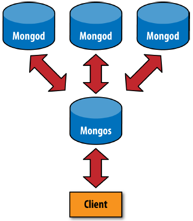
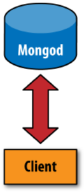
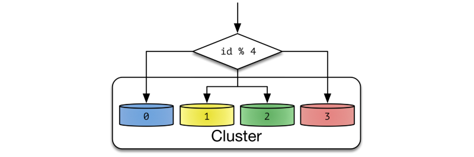
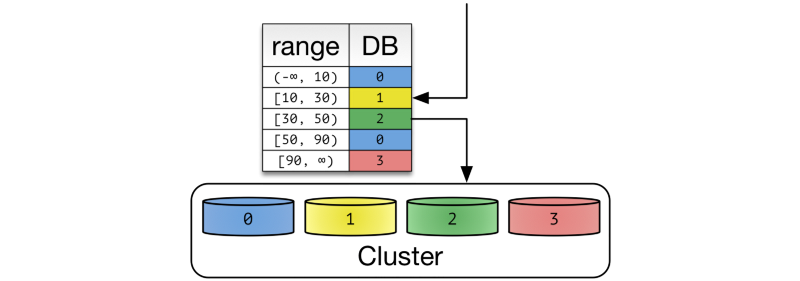

MongoDB is a **cross-platform document-oriented database** program. Classified as a NoSQL database program, MongoDB uses **JSON-like documents** with **schemata**.
the main feature of this technology are:
* **Ad hoc queries:** MongoDB supports **field**, **range query**, and **regular expression searches**.
* **Indexing:** Fields in a MongoDB document can be indexed with **primary** and **secondary**.
* **Replication:** **All writes and reads** are done **on the primary** replica **by default**. Secondaries can **optionally serve read operations**, but that data is only eventually consistent by default.
* **Load balancing:** The **data is split into ranges** (based on the shard key) and **distributed across multiple shards**. (A shard is a master with one or more slaves.). Alternatively, the shard key can be hashed to map to a shard – enabling an even data distribution.
* **File storage:** MongoDB can be used as a file system, called **GridFS**.GridFS can be accessed using mongofiles utility or plugins for Nginx and lighttpd. GridFS **divides a file into parts**, or chunks, and **stores each of those chunks as a separate document**.
* **Aggregation**
	* **Aggregation pipeline(Best performance)**
	* **Map-Reduce**
	* **single-purpose aggregation methods**
* **Server-side JavaScript execution**
* **Capped collections:** fixed-size collections.This type of collection maintains insertion order and, once the specified size has been reached, behaves like a **circular queue**.
* **Transactions**

Technical criticisms
--------------------
* In some failure scenarios where an application can access two distinct MongoDB processes, but these processes cannot access each other, it is possible for MongoDB to return stale reads. In this scenario it is also possible for MongoDB to roll back writes that have been acknowledged.

* In some situations, reads and writes will yield their locks


Uscases
-------
the main mongodb usecases is **Stage a Proof of Concept (POC).**
Maybe this sentence is so agressive about mongodb but we have embrace that; this db is your first stage db. you have to keep in mind that there is no stable situation to stay on if your data growth. If your data size force you to increase nodes more that 10 you will be face with lot of problems!
I face with some of them so it force us to make data sharding in application layer. to keep data available we put 3 node in cluster and shard our data into multiple mongodb culster.

>In MongoDB you can add and remove **shards** or **replica set members** without taking down the database.


For read intensive applications, **scale up your servers** to hold the entire working set in memory and replicate for greater availability.
If your servers’ RAM will not accommodate your working set in memory, **shard to aggregate RAM from multiple replica set clusters.**

this DB is **not sutable for:**
* **Multi-Object Transactions:** It's only supports ACID transactions for a single document.
* **Strong ACID guarantees**
* **Traditional BI**
* **Map/Reduce operation:** It's OK, but not blisteringly fast. So if that's required, something like Hadoop may need to be added into the mix

It's really depend on what functionallity you want from but personally I'm not recommend this db for high load application in read/wirte or use it for some application that hosted in multiple location. MongoDB is a **general-purpose database** that works well for most applications like E-commerce product catalog,Configuration management,Blogs and content management and some stuff like that but as I said before it's really depend on data size and your read/write rate.

Storage engine
--------------
* **WiredTiger Storage Engine (Default)**: It's provides a document-level concurrency model, checkpointing, and compression, among other features.
* **In-Memory Storage Engine (Enterprise only)**: Rather than storing documents on-disk, it retains them in-memory for more predictable data latencies.
*  **MMAPv1 Storage Engine (Deprecated as of MongoDB 4.0)**

The WiredTiger use **internal cache** and the **filesystem cache**. In MongoDB 3.2, the WiredTiger internal cache, by default, will use the larger of either: **50% of RAM minus 1 GB, or 1 GB.** and it's configuratble.

####Capped collections
“Normal” collections in MongoDB are created dynamically and automatically grow in size to fit additional data. MongoDB also supports a different type of collection, called a capped collection, which is **created in advance and is fixed in size.** It will **preallocate** what space you specifed for the collection.
Having fixed-size collections brings up an interesting question: what happens when we try to insert into a capped collection that is already full? The answer is that capped collections behave like circular queues: **if we’re out of space, the oldest document will be deleted, and the new one will take its place**.This means that capped collections automatically age-out the oldest documents as new documents are inserted.
Certain operations are not allowed on capped collections. Documents cannot be removed or deleted (aside from the automatic age-out described earlier), and updates that would cause documents to grow in size are disallowed. By preventing these two operations,we guarantee that documents in a capped collection are stored in insertion order and that there is no need to maintain a free list for space from removed documents.
while reading documents MongoDB returns the documents in the same order as present on disk. This makes the read operation very fast.
While inserting a new document, MongoDB does not have to actually look for a place to accommodate new document on the disk. It can blindly insert the new document at the tail of the collection. This makes insert operations in capped collections very fast.

limitations
-----------
* Max document size: 16 MB
* Max document nesting level: 100
* Namespace is limited to ~123 chars (namespace is db_name + collection_name (or index name))
* You cannot shard a capped collection
* TTL indexes are not compatible with capped collections.
* You cannot delete documents from a capped collection
* DB name is limited to 64 chars
* Default .ns file can store about 24000 namespaces (a namespace is referring to a collection or an index)
* If you index some field, that field can’t contain more than 1024 bytes
* Max 64 indexes per collection
* Max 31 fields in a compound index
* fulltext search and geo indexes are mutually exclusive (you can’t use both in the same query)
* If you set a limit of documents in a capped collection, this limit  can’t be more than 2 * 32. Otherwise, number of documents is unlimited.
* On linux, one mongod instance can’t store more than 64 TB of data (128 TB without journal)
* On windows, mongod can’t store more than 4 TB of data (8 TB without journal)
* Max 12 nodes in a replica set
* Max 7 voting nodes in a replica set
* You can’t automatically rollback more than 300 MB of data. If you have more than this, manual invervention is needed.
* group command doesn’t work in sharded cluster.
* db.eval() doesn’t work on sharded collections. Works on unsharded, though.
* $isolated, $snapshot, geoSearch don’t work in a sharded cluster.
* You can’t refer db object in $where functions.
* If you want to shard a collection, it must be smaller than 256 GB, or else it will likely fail to shard.
* Individual (not multi) updates/removes in a sharded cluster must  include shard key. Multi versions of these commands may not include  shard key.
* Max 512 bytes for shard key values
* You can’t change shard key for a collection once it’s sharded.
* You can’t change value of a shard key of a document.
* aggregate/$sort produces error if sorting takes more than 10 percent of RAM.
* You can’t use $or in 2d geo queries
* You better not use queries with multiple $in parts. If this results in more than 4 million combinations - you get error.
* Database names are case-sensitive (even on case-insensitive file systems)
* Forbidden characters in database names: linux - /. “, windows - /. “ * <>:|?
* Forbidden characters in collection names: $ sign, “system.” prefix
* Forbidden characters in field names: .$
* Hashed index can’t be unique
* Max connection number is hardcoded to 20k.
* Limited security provided to access database and authorization.
* Sharding (i.e. horizontal scaling) in MongoDB require many connections of nodes, and managing them is difficult.
* Every driver has their own language mnemonics, which makes difficult to execute a simple command.
* With MongoDB , document updating are provided a very limited support of queries.


_id and ObjectIds
------
**Every document stored in MongoDB must have an "_id" key.** The "_id" key’s value can be any type, but it **defaults to an ObjectId**. In a single collection, every document must have a **unique** value for "_id", which ensures that every document in a collection can be uniquely identified.
The ObjectId class is designed to be lightweight,while still being easy to generate in a globally unique way across different machines.It's a **synchronize autoincrementing primary keys across multiple servers**.

##Storing Files with GridFS
GridFS is a mechanism **for storing large binary files in MongoDB.** that give you a great disk locality, because MongoDB allocates data files in 2 GB chunks. but it is **slower than accessing files directly through the filesystem** and **it's not modifiable**; you can only modify documents by deleting them and resaving the whole file. MongoDB stores files as multiple documents so it cannot lock all of the chunks in a file at the same time.
So this solution is good that when you have **large files** you’ll be **accessing in a sequential** fashion that **won’t be changing much**.

The MongoDB server actually does almost nothing to “special-case” the handling of GridFS requests; all the work is handled by the **client-side drivers and tools. **The basic idea behind GridFS is that we can store large files by splitting them up into chunks and storing each chunk as a separate document.

##Removing Old Data
There are three popular options for removing old data:
* **capped collections**
* **TTL collections:** it may not be fast enough for very high-write-volume collections
* **Dropping collections per time period:** for example, one collection per month. Every time the month changes, your application starts using this month’s (empty) collection and searching for data in both the current and previous months’ collections. Once a collection is older than, say, six months, you can drop it.

#Administration
##Introduction to Sharding
**Sharding refers to the process of splitting data up across machines;** the term partitioning is also sometimes used to describe this concept. By putting a subset of data on each machine, it becomes possible to store more data and handle more load without requiring larger or more powerful machines, just a larger quantity of less-powerful machines.

MongoDB’s sharding allows you to create a cluster of many machines (shards) and break up your collection across them, putting a subset of data on each shard. This allows your application to grow beyond the resource limits of a standalone server or replica set.

>Many people are confused about the difference between replication and sharding. Remember that replication creates an exact copy of your data on multiple servers, so every server is a mirror-image of every other server. Conversely, every shard contains a different subset of data.

**Sharded client connection**


**Nonsharded client connection**


###How Sharding Works
Sharding is also referred as horizontal partitioning. The distinction of horizontal vs vertical comes from the traditional tabular view of a database. A database can be split **vertically — storing** different tables & columns in a separate database, or **horizontally — storing** rows of a same table in multiple database nodes.


####Algorithmic Sharding
One way to categorize sharding is algorithmic versus dynamic. In algorithmic sharding, the client can determine a given partition’s database without any help. In dynamic sharding, a separate locator service tracks the partitions amongst the nodes.



####Dynamic Sharding

**A dynamic sharding scheme using range based partitioning.**
In dynamic sharding, an external locator service determines the location of entries. It can be implemented in multiple ways. If the cardinality of partition keys is relatively low, the locator can be assigned per individual key. Otherwise, a single locator can address a range of partition keys.

To read and write data, clients need to consult the locator service first. Operation by primary key becomes fairly trivial. Other queries also become efficient depending on the structure of locators. In the example of range-based partition keys, range queries are efficient because the locator service reduces the number of candidate databases. Queries without a partition key will need to search all databases.

##MongoDB Performance
As you develop and operate applications with MongoDB, you may need to **analyze the performance of the application and its database.** When you encounter degraded performance, it is often a function of database access strategies, hardware availability, and the number of open database connections.

Memory Use
With **MMAPv1**,** MongoDB automatically uses all free memory on the machine as its cache**. System resource monitors show that MongoDB uses a lot of memory, but its usage is dynamic. If another process suddenly needs half the server’s RAM, MongoDB will yield cached memory to the other process.

Technically, the operating system’s virtual memory subsystem manages MongoDB’s memory. This means that MongoDB will use as much free memory as it can, swapping to disk as needed. Deployments with enough memory to fit the application’s working data set in RAM will achieve the best performance.

The ```mem.resident``` field provides the amount of resident memory in use. If this exceeds the amount of system memory and there is a significant amount of data on disk that isn’t in RAM, you may have exceeded the capacity of your system.


**Database Profiling**
The Database Profiler collects detailed information about operations run against a mongod instance. The profiler’s output can help to identify inefficient queries and operations.

You can enable and configure profiling for individual databases or for all databases on a mongod instance. Profiler settings affect only a single mongod instance and will not propagate across a replica set or sharded cluster.

See Database Profiler for information on enabling and configuring the profiler.

The following profiling levels are available:

|Level|Description|
|-|-|
|0|The profiler is off and does not collect any data. This is the default profiler level.|
|1|The profiler collects data for operations that take longer than the value of slowms.|
|2|The profiler collects data for all operations.|

#Monitoring
Monitoring for MongoDB
------
Monitoring is a critical component of all database administration. A firm grasp of MongoDB’s reporting will allow you to assess the state of your database and maintain your deployment without crisis.

Monitoring Strategies
------
MongoDB provides various methods for collecting data about the state of a running MongoDB instance:

* Starting in version 4.0, MongoDB offers free Cloud monitoring for standalones and replica sets.
* MongoDB distributes a set of utilities that provides real-time reporting of database activities.
* MongoDB provides various database commands that return statistics regarding the current database state with greater fidelity.
* MongoDB Atlas is a cloud-hosted database-as-a-service for running, monitoring, and maintaining MongoDB deployments.
* MongoDB Cloud Manager is a hosted service that monitors running MongoDB deployments to collect data and provide visualization and alerts based on that data.
* MongoDB Ops Manager is an on-premise solution available in MongoDB Enterprise Advanced that monitors running MongoDB deployments to collect data and provide visualization and alerts based on that data.

Each strategy can help answer different questions and is useful in different contexts. These methods are complementary.

Free Monitoring
------
MongoDB offers free Cloud monitoring for standalones or replica sets.

By default, you can enable/disable free monitoring during runtime using ```db.enableFreeMonitoring()``` and ``` db.disableFreeMonitoring().```

Utilities
------
The MongoDB distribution includes a number of utilities that quickly return statistics about instances’ performance and activity. Typically, these are most useful for diagnosing issues and assessing normal operation.

**mongostat**
mongostat captures and returns the counts of database operations by type (e.g. insert, query, update, delete, etc.). These counts report on the load distribution on the server.


**mongotop**
mongotop tracks and reports the current read and write activity of a MongoDB instance, and reports these statistics on a per collection basis.

Commands
------
MongoDB includes a number of commands that report on the state of the database.

**serverStatus**
The ```serverStatus``` command, or ```db.serverStatus()``` from the shell, returns a general overview of the status of the database, detailing disk usage, memory use, connection, journaling, and index access. The command returns quickly and does not impact MongoDB performance.

**dbStats**
The ```dbStats``` command, or ```db.stats()``` from the shell, returns a document that addresses storage use and data volumes. The dbStats reflect the amount of storage used, the quantity of data contained in the database, and object, collection, and index counters.

Use this data to monitor the state and storage capacity of a specific database. This output also allows you to compare use between databases and to determine the average document size in a database.

**collStats**
The ```collStats``` or ```db.collection.stats()``` from the shell that provides statistics that resemble dbStats on the collection level, including a count of the objects in the collection, the size of the collection, the amount of disk space used by the collection, and information about its indexes.

**replSetGetStatus**
The ```replSetGetStatus``` command (```rs.status()``` from the shell) returns an overview of your replica set’s status. The replSetGetStatus document details the state and configuration of the replica set and statistics about its members.

Use this data to ensure that replication is properly configured, and to check the connections between the current host and the other members of the replica set.


Process Logging
------
During normal operation, mongod and mongos instances report a live account of all server activity and operations to either standard output or a log file. The following runtime settings control these options.

* **quiet.** Limits the amount of information written to the log or output.

* **verbosity.** Increases the amount of information written to the log or output. You can also modify the logging verbosity during runtime with the logLevel parameter or the ```db.setLogLevel()``` method in the shell.

* **path.** Enables logging to a file, rather than the standard output. You must specify the full path to the log file when adjusting this setting.

* **logAppend.** Adds information to a log file instead of overwriting the file.


> 
You can specify these configuration operations as the command line arguments to mongod     or mongos

For example:

```mongod -v --logpath /var/log/mongodb/server1.log --logappend```
Starts a mongod instance in verbose mode, appending data to the log file at ```/var/log/mongodb/server1.log/```.

The following database commands also affect logging:

```getLog``` . Displays recent messages from the mongod process log.

```logRotate``` . Rotates the log files for mongod processes only. See Rotate Log Files.


###Enterprise Options in mongodb 

**Support**
We’re here to help. When something goes wrong, you have a guaranteed response time from our engineers, 24 hours a day, 365 days a year.

And support isn’t just break/fix. You can come to us at any time for:

* Guidance on upgrading to a new release

* Validation of a deployment plan

* Suggestions on how to configure your system for high availability and scalability

* Questions on performance optimization

* A walkthrough of new features and how to use them

* ...and much more

Get support from the engineers who build MongoDB. Learn more.

**Management**
Ops Manager is the best way to manage MongoDB from your data center. Or if you prefer to manage your MongoDB deployment through our cloud service, you can choose MongoDB Cloud Manager instead. Our management platform makes working with MongoDB Enterprise Server simple. Ops Manager and Cloud Manager provide:

* Monitoring. You can’t optimize what you can’t measure. With Ops Manager or Cloud Manager, visualize over 100 performance metrics and tune your deployment. Set up custom alerts that trigger when metrics go out of range, so you can discover performance issues before your users do.

* Automation. Automate common operational tasks like provisioning new nodes, changing configurations across clusters, and perform zero-downtime rolling upgrades. How does a 95% reduction in operational overhead sound?

* Backup. Our backup solution for MongoDB Enterprise Server comes with point-in-time recovery for replica sets and synchronized snapshots of sharded clusters. You won’t find that anywhere else.

Created by the engineers who develop the database, Ops Manager and Cloud Manager are the best management platforms for MongoDB Enterprise Server.

**Advanced Security**
MongoDB Enterprise Server meets your security and compliance standards with Kerberos and LDAP authentication, Red Hat Identity Management Certification, and auditing. In addition to MongoDB’s already comprehensive security framework – which includes Role-Based Access Control, PKI certificates, SSL and Field-Level Redaction – the advanced features in MongoDB Enterprise Server enable you to defend, detect, and control access to your data.

With MongoDB Enterprise Advanced, you have the option of using the Encrypted storage engine for MongoDB. This storage engine provides native encryption at rest for your data, without the performance or management overhead of separate filesystem encryption. And if desired, the Encrypted storage engine will integrate with a third party key management appliance via KMIP.

**Advanced Analytics**
MongoDB’s flexible data model and dynamic schema allow you to store data in rich, multi-dimensional documents to quickly build and evolve your apps. But your Business Intelligence platform expects fixed schemas and tabular data.

The MongoDB Connector for BI lets you use MongoDB as a data source for your SQL-based BI and analytics platforms. Seamlessly create the visualizations and dashboards that will help you extract the insights and hidden value in your multi-structured data. The MongoDB Connector for BI is available only with MongoDB Enterprise Advanced.

**MongoDB Compass**
MongoDB Enterprise Advanced gives you access to MongoDB Compass, the easiest way to explore your MongoDB data. MongoDB Compass analyzes your documents and displays rich structures within your collections in a simple and intuitive GUI. It allows you to quickly visualize and explore your schema to understand the frequency, types and ranges of fields in your data set. MongoDB Compass helps you to build and run ad hoc queries, add and modify documents, review and optimize performance with Visual Explain Plans and index utilization metrics, an identify requirements for document validation rules. MongoDB Compass is the simplest way to interact with MongoDB, with no knowledge of the MongoDB query language required.

**In-Memory Speed**
The speed of in-memory computing, available in MongoDB. The In-Memory storage engine delivers the extreme throughput and predictable latency required by the most demanding applications in AdTech, finance, telecoms, e-commerce, and more. And by mixing storage engines in a replica set, you can achieve the speed of in-memory while still persisting to disk. The In-Memory storage engine is only available with MongoDB Enterprise Advanced.

**Enterprise Software Integration**
MongoDB Enterprise Server fits easily into your existing IT infrastructure and processes. SNMP support connects MongoDB Enterprise Server with your management and monitoring tools.

**Commercial License**
MongoDB Enterprise Advanced includes a commercial license to meet the development and distribution needs of organizations that have policies requiring one, including commercial distributors (OEMs). We also provide a warranty and indemnification.

**Platform Certification**
MongoDB Enterprise Server has been tested and certified for stability and performance on the most popular operating systems. If you’re running Windows, Red Hat/CentOS, Ubuntu, Amazon Linux, Linux on z Systems, LinuxONE, or Linux on Power Systems, MongoDB Enterprise Server is for you.

**On-Demand Training**
Access to our online training, on your schedule and at your pace. Your developers and ops teams can improve their MongoDB skills on demand from wherever they want, whenever it fits their schedule. On-site training is also available.

**Customer Success Program**
We want to help you realize the full potential of your investment in MongoDB. Through the Customer Success Program, we will introduce the resources available to you and check in with you regularly to make sure you are achieving your goals with MongoDB. We'll keep you updated on developments on our end, too – like product updates and events that might interest you.


#Resources
------
* [MongoDB wikipedia](https://en.wikipedia.org/wiki/MongoDB)
* [Path to Transactions - WiredTiger Timestamps (youtube)](https://www.youtube.com/watch?v=mUbM29tB6d8)
* [Storage talk](https://www.slideshare.net/christkv/storage-talk)
* [Hardware requirements](https://www.mongodb.com/blog/post/capacity-planning-and-hardware-provisioning-mongodb-ten-minutes)
* [MongoDB disk and memory requirements(FotoWeb)](https://learn.fotoware.com/02_FotoWeb_8.0/05_Configuring_sites/Setting_the_MongoDB_instance_that_FotoWeb_uses/MongoDB_disk_and_memory_requirements)
* [Hardware Provisioning for MongoDB
](https://www.mongodb.com/presentations/hardware-provisioning-mongodb)
* [Memory usage](https://stackoverflow.com/questions/6861184/is-there-any-option-to-limit-mongodb-memory-usage)
* [Mongodb disadvantages](https://stackoverflow.com/questions/4288615/why-not-mongodb)
* [General points of mangodb](https://stackoverflow.com/questions/5244437/pros-and-cons-of-mongodb)
* [Good or not good for](https://dzone.com/articles/why-mongodb)
* [When to Use MongoDB](https://dzone.com/articles/when-use-mongodb-rather-mysql)
* [Mongodb Limitation](https://www.quora.com/What-are-the-limitations-of-a-MongoDB)
* [MongoDB: The Definitive Guide Book](https://www.amazon.com/MongoDB-Definitive-Powerful-Scalable-Storage-ebook/dp/B00CPSIQ7O)
* [Capped Collections Questions](https://stackoverflow.com/questions/32489869/mongodb-capped-collection-max-size-2g)
* [capped collections points](https://www.tutorialspoint.com/mongodb/mongodb_capped_collections.htm)
* [How sharding works](https://medium.com/@jeeyoungk/how-sharding-works-b4dec46b3f6)