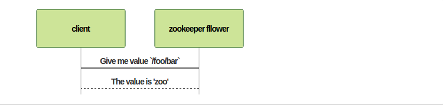

 Zookeeper
=========================================================
ZooKeeper is a distributed **co-ordination service** to manage large set of hosts. Co-ordinating and managing a service in a distributed environment is a complicated process.ZooKeeper framework provides a complete mechanism to overcome all the challenges. Race condition and deadlock are handled using fail-safe synchronization approach.

Usage
-----------------------------------
* **Naming service**: Identifying the nodes in a cluster by name. It is similar to DNS, but for nodes.
* **Configuration management**: Latest and up-to-date configuration information of the system for a joining node (save data in memory).
* **Distributed cluster management**: Joining / leaving of a node in a cluster and node status at real time.
* **Leader election**: Electing a node as leader for coordination purpose.
* **Locking and synchronization service**: Locking the data while modifying it. This mechanism helps you in automatic fail recovery while connecting other distributed applications like Apache HBase.
* **Centralized and Highly reliable data registry**: Availability of data even when one or a few nodes are down.

Benefits
--------
* **Simple distributed coordination process**
* **Synchronization**: Mutual exclusion and co-operation between server processes. This process helps in Apache HBase for configuration management.
* **Ordered Messages**
* **Serialization**: Encode the data according to specific rules. Ensure your application runs consistently. This approach can be used in MapReduce to coordinate queue to execute running threads.
* **Reliability**
* **Atomicity**: Data transfer either succeed or fail  completely, but no transaction is partial.

Architecture
------------


|Part|Description|
|----|-----------|
|Client|Clients, one of the nodes in our distributed application cluster, access information from the server. For a particular time interval, every client sends a message to the server to let the sever know that the client is alive. Similarly, the server sends an acknowledgement when a client connects. If there is no response from the connected server, the client automatically redirects the message to another server.
|Server|Server, one of the nodes in our ZooKeeper ensemble, provides all the services to clients. Gives acknowledgement to client to inform that the server is alive.|
|Ensemble|Group of ZooKeeper servers. The minimum number of nodes that is required to form an ensemble is 3.|
|Leader| Server node which performs automatic recovery if any of the connected node failed. Leaders are elected on service startup.|
|Follower|Server node which follows leader instruction.|

In Zookeeper ensemble if we have three nodes and one node fails, we have majority and so, it is the minimum requirement. It is mandatory for a ZooKeeper ensemble to have at least three nodes in a live production environment. The extra node does not serve any purpose and so, it is better to add nodes in odd numbers, e.g., 3, 5, 7.
We know that a write process is expensive than a read process in ZooKeeper ensemble, since all the nodes need to write the same data in its database. So, it is better to have less number of nodes (3, 5 or 7) than having a large number of nodes for a balanced environment.

Hierarchical Namespace
----------------------

Each node in the namespace is called as a **Znode** (circles in above pic). One thing that I need to mention here is that every Znode must be created sequentialy with at least one property and you can't create set of Znode in a single command like `create /root/foo/bar/zoo`.
Every znode has:
1. **Version number**: Every time the data associated with the znode version number increase and it's used for data syncronization with other zookeepers
2. **Action Control List (ACL)**
3. **Timestamp**: create, modified time
4. **Data length**: Total amount of the data stored in a znode (maximum 1MB).

```bash
[zk: localhost:2181(CONNECTED) 1] get /fooNode
“Myfirstzookeeper-app”
cZxid = 0x7f
ctime = Tue Sep 29 16:15:47 IST 2015
mZxid = 0x7f
mtime = Tue Sep 29 16:15:47 IST 2015
pZxid = 0x7f
cversion = 0
dataVersion = 0
aclVersion = 0
ephemeralOwner = 0x0
dataLength = 22
numChildren = 0
```

**featurs** and below **types**:

|type|description|command|
|----|-----------||
|**Persistence (default)**|-|`create /path data`|
|**Ephemeral**| Ephemeral znodes are **active until the client is alive**. When a client gets **disconnected** from the ZooKeeper ensemble, then the ephemeral znodes get **deleted automatically**. For this reason, only ephemeral znodes are **not allowed to have a children further**. **If an ephemeral znode is deleted, then the next suitable nod will fill its position** (Leader election). Ephemeral znodes play an important role in Leader election.|`create -e /path data`|
|**Sequential**| Sequential znodes **can be either persistent or ephemeral**. When a new znode is created as a sequential znode, then ZooKeeper sets the path of the znode by attaching a 10 digit sequence number to the original name. For example, if a znode with path /myapp is created as a sequential znode, ZooKeeper will change the path to /myapp0000000001 and set the next sequence number as 0000000002. If two sequential znodes are created concurrently, then ZooKeeper never uses the same number for each znode. Sequential znodes play an important role in Locking and Synchronization.|`create -s /path data` or `create -s -e /path data`|

Session
--------
Requests in a session are executed in FIFO order. Once a client connects to a server, the session will be established and a session id is assigned to the client.
The client sends heartbeats at a particular time interval to keep the session valid. If the ZooKeeper ensemble does not receive heartbeats from a client for more than the period (session timeout) specified at the starting of the service, it decides that the client died.

Watch
-----
Watches are a simple mechanism for the client to get notifications about the changes in the ZooKeeper ensemble.It can be set with **get** command.
```bash
get /path [watch] 1
```
> Note: The output is similar to normal get command but the watcher is set.


Zookeeper flow
--------------
Clients can be connect to a leader or a follower node.


* **Request Processor**: Present only in leader node. It governs write requests from the follower node.
* **Atomic broadcasts**: Responsible for broadcasting the changes from the leader node to the follower nodes.


Read flow:


```
sequenceDiagram
    client->zookeeper fllower: Give me value `/foo/bar`
    zookeeper fllower-->client: The value is 'zoo'
```

Write flow:


```
sequenceDiagram
    client->zookeeper follower: write /foo/bar = zoo
    zookeeper follower-->zookeeper leader: write /foo/bar = zoo
    zookeeper leader-->zookeeper follower: Sync with me
    zookeeper follower-->zookeeper leader: Successfull
    zookeeper leader->client: Successfull
```
This write sequence means that you cannot have concurrent writes. The guarantee of linear writes is the reason for the fact that ZooKeeper does not perform well for write-dominant workloads. In particular, it should not be used for interchange of large data, such as media. As long as your communication involves shared data, ZooKeeper helps you.

Disconnect from the ZooKeeper ensemble, once all the tasks are completed. If the client is inactive for a prolonged time, then the ZooKeeper ensemble will automatically disconnect the client.

Leader election flow
--------------------
It's implemented with Zookeeper ephemeral sequential znode feature.
1. All the nodes create a sequential, ephemeral znode with the **same path**
2. For a given instance, the node which creates the smallest number in the znode becomes the leader and all the other nodes are followers.
3. If the leader goes down(can't send heartbeats at the specific time) so it's session and ephemeral data will be deleted and other followers will get the notification through watcher about the leader removal
4. The znode with smallest number wiil be selected as a leader.

Installation
------------

###Single node
Create a bash file with content below and then execute that
```bash
#!/bin/bash

locale-gen en_US.UTF-8 && useradd zookeeper -m && passwd zookeeper
apt-get install sudo && adduser zookeeper sudo && chsh -s /bin/bash zookeeper && su - zookeeper
sudo apt-get install -y default-jre zookeeperd
```

###Cluster
Create a bash file with below content and then execute that
```bash
#!/bin/bash
locale-gen en_US.UTF-8 && useradd zookeeper -m && passwd zookeeper
apt-get install sudo && adduser zookeeper sudo && chsh -s /bin/bash zookeeper && su - zookeeper
sudo apt-get install -y default-jre zookeeperd && nano /etc/zookeeper/cfg/zfg.cnf
sudo nano /etc/zookeeper/cfg/myid
sudo service zookeeper restart
```

In order to cluster Znode whith each other first of all you need to add their static ip in `zfg.cfg` config file
```bash
tickTime=2000

#Replace the value of dataDir with the directory where you would like ZooKeeper to save its data
dataDir=<$ZooKeeper_Base_Dir/data>

#Replace the value of dataLogDir with the directory where you would like ZooKeeper to log
dataLogDir=<$ZooKeeper_Base_Dir/logs>

clientPort=2181
initLimit=10
syncLimit=5

server.1=192.168.120.81:2888:3888
server.2=192.168.120.82:2888:3888
server.3=192.168.120.83:2888:3888
```
First thing that you would need to do in above zoo.cfg file is to replace the value of **dataDir** and **dataLogDir** with the directory where you would like ZooKeeper to save its data and log respectively.(In-order to catch better performance place the `dataLogDir` to a separate physical disc)

**clientPort** property, as the name suggests, is for the clients to connect to ZooKeeper Service.

Next let's talk about the last two entries in server.x=hostname:nnnnn:mmmmmm format. Firstly, there are two port numbers **nnnnn(2888)** and **mmmmm(3888)**. The **first** *followers* use to **connect to the leader**, and the **second** is for **leader election**. Secondly, x in server.x denotes the id of node. Each server.x row must have unique id. Each server is assigned an id by creating a file named `/etc/zookeeper/conf/myid`, one for each server, which resides in that server's data directory, as specified by the configuration file parameter dataDir.

The **myid** file consists of a single line containing only the text of that machine's id. So myid of server 1 would contain the text 1 and nothing else. The **id must be unique** within the ensemble and should have a value between 1 and 255.

Monitoring
----------
One of the best tools for monitor system visualy is [Zkui](https://github.com/DeemOpen/zkui)
### Zkui Up and running
```bash
docker run -d -p 9090:9090 -e ZKUI_ZK_SERVER=<zookeeper_server_ip:2181,...> --name=zkui qnib/zkui
```
Run it on your machine and connect it to your remote Znode client port(2181). It' accessable from **localhost:9090**.

Resources
----------
* [Zookeper documentation](http://zookeeper.apache.org/doc/trunk/)
* [Setting up Apache ZooKeeper Cluster](http://www.allprogrammingtutorials.com/tutorials/setting-up-apache-zookeeper-cluster.php)
* [ZooKeeper-Distributed Process Coordination book](https://www.amazon.com/ZooKeeper-Distributed-Coordination-Flavio-Junqueira/dp/1449361307)
* [ZooKeeper fundamentals, deployment, and applications](http://www.ibm.com/developerworks/library/bd-zookeeper/)
* [Zookeeper Tutorial](http://www.tutorialspoint.com/zookeeper/)